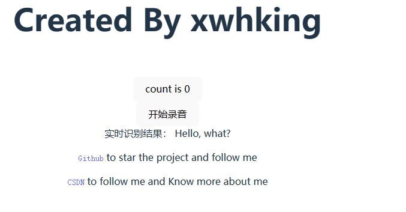
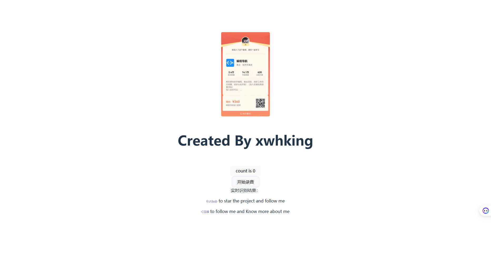

# 通过讯飞 API 接口用 Vue 实现实时语音转写
## 前言

本项目中实时语音能够转写的最大时间为 60 s， 这个数据也是由 API 提供方给限制掉的

为什么我会需要这个点击按钮以后能够实现实时语音的转写呢，因为被课程所迫，选了这个方向就必须要实现一下。

因为找了一下点击按钮然后进行语音转写的现成的 Vue 组件没有找到能用的，所以只能够自己写一下啦。具体实现（采用 WebSocket 进行通讯）的代码参考官方提供的 demo，demo [下载地址](https://www.xfyun.cn/doc/asr/voicedictation/API.htm). 讯飞星火平台还提供其他的 SDK 调用，感兴趣的可以自行研究一下

## 效果演示

> 这里只是简单的实现了一下通过点击按钮能够拿到语音识别的结果，如果你有其他的想法，可以对代码进行扩充。

这是我上一次识别结束后的结果：

你开始录音的时候他会是这样子的，只能进行 60s 的转写，如果需要转写更多只能通过另外的办法

具体就是点击开始录音就能够开启 60s 的录音并且显示实时转写的结果，就这么简单

## 具体如何启动使用

1. 把项目下载到本地
2. 进入到项目目录，进入命令行模式
3. 运行
```bash
npm install
```
4. 然后就是运行项目了
   - 在运行项目之前请到组件目录中去找到 VoiceTranslate.vue 这个组件把其中的APPID，API_KEY，SECRET_KEY替换成你自己的，文件中有详细的注释。
   - 关于如何获取这些直接去[创建一个应用](https://console.xfyun.cn/app/create)就好了，创建好后能够有 500 次的免费额度，新人还能够有一年 5w 次的免费额度
```bash
npm run dev
```
5. 运行结果如下图：


## 项目结构简述

```
├─.idea
├─.vscode
├─node_modules
│  ├─.bin
│  ├─.vite
│  │  ├─deps
│  │  └─deps_temp_2e6e8e62
│  ├─@babel
│  │  └─parser
│  │      ├─bin
│  │      ├─lib
│  │      └─typings
│  ├─@esbuild
│  │  └─win32-x64
│  ├─@jridgewell
│  │  └─sourcemap-codec
│  │      └─dist
│  │          └─types
│  ├─@vitejs
│  │  └─plugin-vue
│  │      └─dist
│  ├─@vue
│  │  ├─compiler-core
│  │  │  └─dist
│  │  ├─compiler-dom
│  │  │  └─dist
│  │  ├─compiler-sfc
│  │  │  └─dist
│  │  ├─compiler-ssr
│  │  │  └─dist
│  │  ├─reactivity
│  │  │  └─dist
│  │  ├─reactivity-transform
│  │  │  └─dist
│  │  ├─runtime-core
│  │  │  └─dist
│  │  ├─runtime-dom
│  │  │  └─dist
│  │  ├─server-renderer
│  │  │  └─dist
│  │  └─shared
│  │      └─dist
│  ├─csstype
│  ├─esbuild
│  │  ├─bin
│  │  └─lib
│  ├─estree-walker
│  │  ├─dist
│  │  │  ├─esm
│  │  │  └─umd
│  │  ├─src
│  │  └─types
│  ├─magic-string
│  │  └─dist
│  ├─nanoid
│  │  ├─async
│  │  ├─bin
│  │  ├─non-secure
│  │  └─url-alphabet
│  ├─picocolors
│  ├─postcss
│  │  └─lib
│  ├─rollup
│  │  └─dist
│  │      ├─bin
│  │      ├─es
│  │      │  └─shared
│  │      └─shared
│  ├─source-map-js
│  │  └─lib
│  ├─vite
│  │  ├─bin
│  │  ├─dist
│  │  │  ├─client
│  │  │  ├─node
│  │  │  │  └─chunks
│  │  │  └─node-cjs
│  │  └─types
│  └─vue
│      ├─compiler-sfc
│      ├─dist
│      ├─jsx-runtime
│      └─server-renderer
├─public
└─src
    ├─assets
    ├─components
    └─voice-utils
        ├─dist
        └─utilJS

```
- 其中 node—modules 就是依赖库
- public 里面放了公共的静态资源
- src
  - assets 里面放了静态资源
  - components 里面放了组件，本项目体态小只有两个组件
    - 一个就是显示的HelloWorld组件
    - 一个就是显示按钮进行语音识别的组件
  - voice-utils 里面放了语音识别的库，这个里面的文件是这个项目的核心文件（来源于迅飞星火的 demo 项目），没有这个语音识别就会运行不起来

> 有问题请联系作者 Email： 2837468248@qq.com 请说明来意


